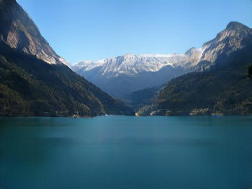
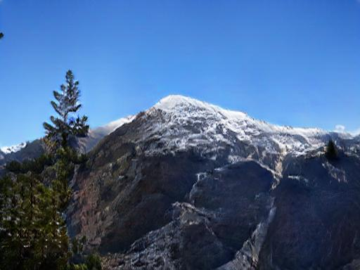

# jittor-ST605-NaturePainter
## Descripition
This repository is **ST605** team's official implementation of competition [第二届\[计图Jittor\]人工智能挑战赛](https://www.educoder.net/competitions/index/Jittor-3) issue 1(赛题一) which is a semantic image synthesis task. All of the codes are based on a newly deep learning freamwork [Jittor](https://cg.cs.tsinghua.edu.cn/jittor/).  Our results achieved 6th rank in track A and 7th in track B.

  

## Data Preparation
For training data and test data with track A and B, please follow the [competition's website](https://www.educoder.net/competitions/index/Jittor-3) for downloading. We assume that all of the real images are with .jpg format and all of the label images are with .png format. If you would like to train on your own dataset, please follow the suggested folder structure:
```
flickr
│
├─train
│   └─imgs
│   │   └─ *.jpg
│   └─labels
│       └─ *.png
├─testA
│   └─labels
│       └─ *.png
└─testB
    └─labels
        └─*.png
```
## Environments
If you want to achieve the same performance, we suggest to run this code on 8 A100 GPUs with batch size 24. 

For minimal training, we highly sugget to run in GPU higher or eaqul to `3090`, `3090Ti`, `V100`, `A100`.

For our environments:
```
Cuda: 11.1.1
Cudnn: 8
Python: 3.7
Jittor: 1.3.4.16
```
Please install other dependencies by:
```
git clone https://github.com/Taited/jittor-ST605-NaturePainter
python3.7 -m pip install --upgrade pip
python3.7 -m pip install -r requirements.txt
```
## Training Scripts
We already set defaul configs in `main.py`. Please specify your own data path by setting `--input_path` with `./dataset/flickr` in Data Preparation. Please specify training log root by setting `--training_log_path`. 

For multi-gpu training:
```
CUDA_VISIBLE_DEVICES="0,1,2,3" mpirun -np 4 python3.7 -m main.py --input_path ./dataset/flickr --training_log_path ./training_log/flickr
```

For single gpu training:
```
python3.7 -m main.py --input_path ./dataset/flickr --training_log_path ./training_log/flickr
```

## Inference
The minimal inference requirement is running in a device which GPU memory is geater than `13G`.
```
python3.7 -m inference.py --input_path ./dataset/flickr --ckpt_path your_ckpt.pkl
```

## Competition Check Codes
For training, run:
```
python3.7 train.py --input_path ./flickr
```

For generating results, please download ckpt file from [BaiduNetDisk](https://pan.baidu.com/s/1PNxdkI55PTBXH6ITUBSgSQ?pwd=k7pk).
Then, run:
```
python3.7 test.py --input_path ./flickr/testB/labels --output_path ./results
```
## Acknowledgements
This repository is based on [OASIS](https://github.com/boschresearch/OASIS)'s official implementation. Please find more details in their paper: [You Only Need Adversarial Supervision for Semantic Image Synthesis](https://arxiv.org/abs/2012.04781).

For the implementation of spectral norm, we adoptted a third party implementation from [Jittor's Discussion Website](https://discuss.jittor.org/t/topic/194).
